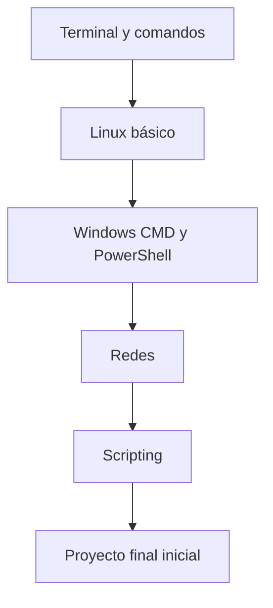

# Itinerarios de aprendizaje

Esta guía puede usarse de varias formas según el nivel y el objetivo.

---

## Itinerario 1: empezar desde cero

Para alumnado que todavía no domina la terminal.

1. [Terminal y comandos](01-terminal-y-comandos.md)
2. [Linux: administración](03-linux-administracion.md)
3. [Windows CMD y PowerShell](04-windows-cmd-powershell.md)
4. [Redes y servicios](05-redes-servicios.md)
5. [Fundamentos de scripting](02-fundamentos-scripting.md)
6. [Ejercicios](../recursos/ejercicios.md)

---

## Itinerario 2: segundo de ASIR

Para cubrir contenidos habituales de administración, servicios, seguridad y automatización.

1. [Hoja de ruta](00-hoja-ruta.md)
2. [Usuarios y permisos](06-usuarios-permisos.md)
3. [Procesos, servicios y logs](07-procesos-servicios-logs.md)
4. [Backups y almacenamiento](08-backups-almacenamiento.md)
5. [Redes y servicios](05-redes-servicios.md)
6. [Bases de datos](10-bases-datos.md)
7. [Seguridad y hardening](09-seguridad-hardening.md)
8. [Active Directory y LDAP](20-active-directory-ldap.md)
9. [Runbooks e incidencias](17-runbooks-incidencias.md)

---

## Itinerario 3: scripting y automatización

Para aprender a crear scripts útiles.

1. [Fundamentos de scripting](02-fundamentos-scripting.md)
2. [Plantillas de scripts](../recursos/plantillas-scripts.md)
3. [Automatización profesional](12-automatizacion-profesional.md)
4. [Git y GitHub](14-git-github.md)
5. [Ansible e infraestructura como código](18-ansible-iac.md)
6. [Integración con Script-Lab](19-integracion-script-lab.md)

---

## Itinerario 4: nivel profesional

Para subir desde ASIR hacia administración profesional.

1. [Git y GitHub](14-git-github.md)
2. [Docker y contenedores](15-docker-contenedores.md)
3. [Monitorización](16-monitorizacion.md)
4. [Runbooks e incidencias](17-runbooks-incidencias.md)
5. [Ansible e infraestructura como código](18-ansible-iac.md)
6. [Proyecto final de mantenimiento](../proyectos/proyecto-final-mantenimiento.md)

---

## Recomendación semanal

| Semana | Trabajo recomendado |
|---|---|
| 1 | Terminal, rutas, ayuda y comandos básicos |
| 2 | Linux: archivos, permisos, usuarios y procesos |
| 3 | Windows CMD y PowerShell |
| 4 | Redes, DNS, puertos y firewall |
| 5 | Servicios, logs y diagnóstico |
| 6 | Backups, almacenamiento y restauración |
| 7 | Scripting básico |
| 8 | Scripting con errores, logs y parámetros |
| 9 | Seguridad, hardening y usuarios |
| 10 | Bases de datos y aplicaciones de sistema |
| 11 | Git, Docker y automatización |
| 12 | Proyecto final y documentación |
